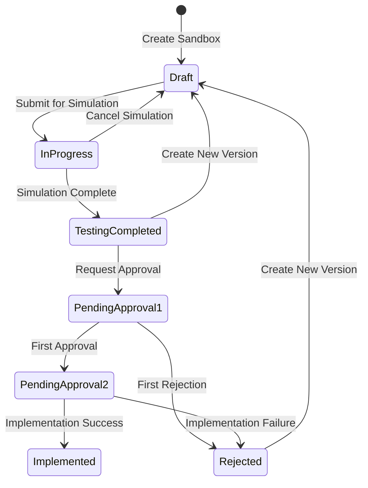

# Customer Risk Rating (CRR) 2.0 - Product Requirements Document

---

## Document Information

| Field | Value |
|-------|-------|
| **Product** | Customer Risk Rating (CRR) Modernization Platform |
| **Document Type** | Product Requirements Document (PRD) |
| **Version** | 2.0 |
| **Last Updated** | January 2026 |
| **Owner** | CRR Product Team - American Express |
| **Status** | Active Development (PI 26.1) |

---

## Executive Summary

The Customer Risk Rating (CRR) 2.0 platform is a comprehensive modernization initiative to transform how American Express configures, tests, and deploys AML (Anti-Money Laundering) risk scoring logic across global markets. The platform addresses critical gaps in the current system where rules and assets are managed independently, leading to untested production states, audit gaps, and regulatory risk.

**Key Transformation Goals:**
- Unify all CRR configuration (Rules, Assets, Fundamental Assessment) into a single sandbox workflow
- Ensure atomic, version-controlled promotion to production with full rollback capability
- Provide complete audit lineage from change creation through production implementation
- Enable centralized asset management with cross-market governance and copy-on-write protection

---

## 1. Product Vision

### 1.1 Problem Statement

The current CRR system manages rule configurations, assets (reusable risk policy lists), and fundamental assessments as separate, independently promoted entities. This creates significant operational and regulatory risks:

| Problem | Business Impact |
|---------|-----------------|
| **Independent Merges** | Rules and assets can reach production in untested combinations |
| **Partial Logic States** | Production may contain configurations that were never simulated together |
| **Explainability Gaps** | Cannot trace why a customer's CRR changed for audit purposes |
| **Cross-Market Risk** | Market-specific changes can inadvertently affect other markets |
| **Manual Asset Management** | File-based CSV uploads lead to duplication and inconsistency |

### 1.2 Vision Statement

> Create a unified, auditable, and atomic CRR configuration platform where every risk decision is tested as a complete change set before reaching production, with full traceability and cross-market governance.

### 1.3 Target Outcomes

1. **Zero untested production states** - All configuration combinations are simulated before deployment
2. **Complete audit lineage** - Every change traceable from creation to production
3. **Simplified governance** - Clear Enterprise vs Market scope boundaries
4. **Reduced manual work** - Centralized asset management eliminates file duplication


---

## 2. User Personas

### 2.1 Primary Personas

| Persona | Role | Permissions | Primary Goals |
|---------|------|-------------|---------------|
| **CRR Business User** | Compliance Analyst/Manager | Full configuration authority | Create/edit rules, assets, FA; run simulations; promote to production |
| **Market Compliance Officer** | Regional Compliance Lead | View-only access | Reference production configuration; export for auditors; understand market-specific rules |

### 2.2 Persona Capabilities Matrix

| Capability | CRR Business User | Market Compliance Officer |
|------------|-------------------|---------------------------|
| Create/Edit Sandbox | ✅ | ❌ |
| Run Simulation | ✅ | ❌ |
| Approve Changes | ✅ | ❌ |
| Promote to Production | ✅ | ❌ |
| View Production Config | ✅ | ✅ |
| Export Assets/Reports | ✅ | ✅ |
| Create/Edit Assets | ✅ | ❌ |
| View Market-Specific Data | All Markets | Assigned Markets Only |

---

## 3. CRR Risk Framework Architecture

### 3.1 Hierarchy Model

```
Risk Framework
├── Risk Categories (e.g., Geographic Risk, Product Risk)
│   └── Risk Elements (specific risk dimensions)
│       └── Rulesets (executable risk logic units)
│           ├── Rule Logic (nested expressions)
│           ├── Weighting (relative importance)
│           └── Multipliers (dynamic amplification)
```

### 3.2 Rule Logic Model

Each rule is defined as: **Datapoint** → **Operator** → **Value**

```
Example: Customer_Jurisdiction IN High_Risk_Countries
```

- **Datapoints**: Customer attributes (jurisdiction, occupation, product type, etc.)
- **Operators**: IN, EQUALS, GREATER_THAN, CONTAINS (constrained by datapoint type)
- **Values**: Static values or **Assets** (reusable lists)

### 3.3 Assets Definition

An **Asset** is a named, versioned list of values validated against a reference data table.

| Property | Description |
|----------|-------------|
| **Structure** | Array of values (even single values are treated as lists) |
| **Validation** | Values validated at creation against reference data tables |
| **Reuse** | Can be used across rules, rulesets, elements, categories, and markets |
| **Scale** | ~100 assets today, scaling to ~1000+ |

---

## 4. Feature Overview

### 4.1 Feature 1: Unified Sandbox Journey

**Feature ID:** F817944  
**Feature Name:** CRR - Unified Sandbox Configuration Experience (UI & Journey Revamp)

#### Description
Consolidate all CRR configuration changes (Rules, Assets, Fundamental Assessment) into a single, version-controlled sandbox workflow with atomic promotion and complete audit lineage.

#### Key Capabilities
- Create Enterprise or Market-scoped sandboxes
- Navigate between Rules/Assets/FA within sandbox context
- Create immutable version snapshots on simulation submission
- Two-step approval workflow with different approvers
- Atomic promotion with full transaction rollback
- Complete audit trail export

#### Scope Governance
| Active Sandbox | Enterprise Option | Market Options |
|----------------|-------------------|----------------|
| None | ✅ Enabled | ✅ Enabled |
| Enterprise | ✅ (exists) | ❌ Disabled |
| Any Market | ❌ Disabled | ✅ Other markets enabled |

---

### 4.2 Feature 2: Asset Manager

**Feature ID:** F817940  
**Feature Name:** CRR - Enable Asset Manager Functionality E2E (Analysis & Build) E2

#### Description
Centralized, sandbox-driven asset lifecycle management with versioning, cross-market visibility, and copy-on-write protection.

#### Key Capabilities
- Create assets within sandbox with reference data validation
- Automatic status transitions (Draft → Sandbox → Production → Archived)
- Visual indicators for shared vs local assets
- Copy-on-write workflow for shared assets in Market sandboxes
- Enterprise asset propagation to all markets on promotion
- Two-sheet Excel export (Values + References)

#### Asset Editability Rules

| Asset Status | Sandbox Scope | Editability |
|--------------|---------------|-------------|
| Draft | Any | ✅ Direct edit (no versioning) |
| Sandbox (Local) | Home Market | ✅ Edit with versioning |
| Sandbox (Shared) | Market | 🔄 Copy-on-write prompt |
| Sandbox (Any) | Enterprise | ✅ Edit with versioning |
| Production | Standalone | ❌ Export only |

---

### 4.3 Feature 3: UI Enhancements

**Feature ID:** F817939  
**Feature Name:** CRR - UI Enhancements & Modifications and Miscellaneous Work in E2

#### Description
Incremental UI improvements, defect fixes, and technical debt resolution.

---

## 5. Functional Requirements

### 5.1 Unified Sandbox Journey Requirements

#### 5.1.1 Sandbox Creation and Scope Selection

| Requirement | Description |
|-------------|-------------|
| **F1-R01** | Users create sandboxes by selecting Enterprise or Market scope |
| **F1-R02** | First-time setup (no production) shows only Enterprise option |
| **F1-R03** | Enterprise and Market sandboxes cannot coexist (mutual exclusion) |
| **F1-R04** | Baseline copied from latest production configuration on creation |
| **F1-R05** | Clear tooltip messages explain disabled scope options |

#### 5.1.2 Sandbox Lifecycle States



#### 5.1.3 Versioning Requirements

| Requirement | Description |
|-------------|-------------|
| **F1-R10** | All edits accumulate in Draft until Submit creates immutable snapshot |
| **F1-R11** | Snapshot captures all three configuration types (Rules + Assets + FA) |
| **F1-R12** | Snapshot links to specific asset version numbers |
| **F1-R13** | Rollback creates new version from historical baseline |
| **F1-R14** | Version history displays with horizontal navigation controls |

#### 5.1.4 Simulation and Approval

| Requirement | Description |
|-------------|-------------|
| **F1-R20** | Submit displays change summary modal with hierarchical pivot |
| **F1-R21** | Justification comment required before submission |
| **F1-R22** | Two different users required for approval |
| **F1-R23** | Rejection includes mandatory comments |

#### 5.1.5 Atomic Promotion

| Requirement | Description |
|-------------|-------------|
| **F1-R30** | All components merge in single database transaction |
| **F1-R31** | Partial failure triggers complete rollback (no partial commits) |
| **F1-R32** | Enterprise assets propagate to all markets on promotion |
| **F1-R33** | Markets using custom copies are skipped in propagation |

---

### 5.2 Asset Manager Requirements

#### 5.2.1 Asset Creation

| Requirement | Description |
|-------------|-------------|
| **F2-R01** | Assets created only within sandbox context |
| **F2-R02** | Real-time duplicate name validation |
| **F2-R03** | Reference data validation on CSV upload |
| **F2-R04** | New assets created with Draft status, version 1 |
| **F2-R05** | Draft assets visible in all sandboxes globally |

#### 5.2.2 Asset Lifecycle

| Requirement | Description |
|-------------|-------------|
| **F2-R10** | Status auto-transitions Draft → Sandbox on first rule use |
| **F2-R11** | Usage metadata tracks market/ruleset/rule references |
| **F2-R12** | Removing all rule references reverts status to Draft |
| **F2-R13** | Production status on sandbox promotion |
| **F2-R14** | Previous versions marked Archived (hidden in UI, retained for audit) |

#### 5.2.3 Asset Visibility and Editability

| Requirement | Description |
|-------------|-------------|
| **F2-R20** | All assets visible regardless of scope or status |
| **F2-R21** | Visual color indicators for shared assets (not text labels) |
| **F2-R22** | Shared assets trigger copy-on-write in Market sandboxes |
| **F2-R23** | All assets editable with versioning in Enterprise sandbox |
| **F2-R24** | Edit buttons disabled in non-Draft sandbox states |

#### 5.2.4 Copy-on-Write Workflow

| Requirement | Description |
|-------------|-------------|
| **F2-R30** | Confirmation modal shows markets using shared asset |
| **F2-R31** | Default copy name: `{OriginalName}_copy` |
| **F2-R32** | List Name field disabled (cannot change reference table) |
| **F2-R33** | Real-time duplicate validation as user types |
| **F2-R34** | Save disabled until unique name entered |

#### 5.2.5 Asset Export

| Requirement | Description |
|-------------|-------------|
| **F2-R40** | Export generates two-sheet Excel workbook |
| **F2-R41** | Values sheet: single column with all asset values (no header) |
| **F2-R42** | References sheet: Scope, Status, Risk Category, Risk Element, Ruleset, Rule |
| **F2-R43** | All values human-readable (names, not IDs) |
| **F2-R44** | Filename format: `{AssetName}_v{version}.xlsx` |

---

## 6. Non-Functional Requirements

### 6.1 Performance

| Metric | Target |
|--------|--------|
| Sandbox creation | < 5 seconds |
| Configuration save | < 2 seconds |
| Simulation progress update | ≤ 5 second polling |
| Asset export (1000 values, 50 references) | < 10 seconds |
| Duplicate name validation | < 500ms |
| Atomic promotion (50 rules, 20 assets, 10 FA) | < 30 seconds |

### 6.2 Scalability

| Metric | Capacity |
|--------|----------|
| Concurrent sandboxes | 4 (1 Enterprise + 3 Markets, or 4 Markets) |
| Assets per system | Up to 1,000 |
| Values per asset | Up to 10,000 |
| Ruleset references per asset | Up to 100 |
| Versions per sandbox | Up to 10 (before pagination) |
| Simulation population | Up to 10 million accounts |

### 6.3 Security

- All operations require ADS (Active Directory Services) authentication
- Role-based access control for sandbox operations
- Two-factor approval for production implementation
- Tamper-proof audit logs encrypted at rest
- CSV validation for malicious content

### 6.4 Compliance

- Full lineage from sandbox creation through production
- Track "who/what/when/why" for every change
- Historical snapshots preserved for minimum 7 years
- Exportable audit logs in standard formats

---

## 7. User Stories Summary

### 7.1 Feature 1: Unified Sandbox Journey (7 Stories)

| Story | Title | Summary |
|-------|-------|---------|
| **1.1** | Dynamic Sandbox Scope Selection | Enterprise/Market mutual exclusion with dynamic dropdown options |
| **1.4** | Complete Configuration Snapshot | Immutable version capturing Rules + Assets + FA on submit |
| **1.5** | Submit Confirmation with Change Summary | Hierarchical pivot structure showing impact scope |
| **1.9** | Atomic Promotion with Rollback | Single transaction merge with complete rollback on failure |
| **1.10** | Rollback to Historical Version | Create new version from historical baseline |

### 7.2 Feature 2: Asset Manager (9 Stories)

| Story | Title | Summary |
|-------|-------|---------|
| **2.1** | Asset Database Model | Versioning, usage tracking, lifecycle states |
| **2.2** | Asset Creation in Sandbox | Modal with validation, Draft status creation |
| **2.3** | Asset Status Transition | Auto-transition when used in rules |
| **2.4** | Asset List with Visual Indicators | Shared vs local asset distinction |
| **2.5** | Asset Editability Rules | Context-based edit permissions |
| **2.6** | Copy-on-Write Workflow | Shared asset protection with copy creation |
| **2.7** | Enterprise Asset Propagation | Auto-propagate to markets on promotion |
| **2.8** | Asset Export | Two-sheet Excel workbook generation |
| **2.9** | Standalone Asset Manager | Read-only production view by market |

---

## 8. Release Scope

### 8.1 In Scope (PI 26.1)

✅ Enterprise vs Market mutual exclusion  
✅ Unified sandbox configuration (Rules/Assets/FA)  
✅ Immutable version snapshots  
✅ Atomic promotion with rollback  
✅ Asset versioning and lifecycle  
✅ Copy-on-write for shared assets  
✅ Enterprise asset propagation  
✅ Two-sheet asset export  
✅ Read-only standalone Asset Manager  

### 8.2 Out of Scope

❌ Authorization/permissions management (separate effort)  
❌ Concurrent edit collision detection (minimal user base)  
❌ Multi-market simulation  
❌ Scheduled implementation  
❌ Sandbox templates/cloning  
❌ Advanced conflict resolution UI  
❌ Bulk sandbox operations  
❌ Asset comparison tool  

### 8.3 Future Enhancements

- Pessimistic locking for Draft edits
- Advanced simulation analytics
- Sandbox diff comparison
- Automated validation rules
- Import from external systems

---

## 9. Dependencies

### 9.1 External Dependencies

| Dependency | Team | Impact |
|------------|------|--------|
| Database schema provisioning | Database Team | Required for data model |
| Simulation engine availability | Backend Platform | Required for testing |
| Notification service | Platform Services | Required for alerts |
| Authentication/RBAC | Security Team | Required for approvals |

### 9.2 Internal Dependencies

| Source | Target | Relationship |
|--------|--------|--------------|
| Asset Manager | Sandbox Journey | Assets editable within sandbox |
| Sandbox APIs | Frontend | UI requires CRUD endpoints |
| Rule Configuration | Asset Selection | Rules select assets from dropdown |

---

## 10. Risks and Mitigations

| Risk | Impact | Probability | Mitigation |
|------|--------|-------------|------------|
| Transaction timeout during promotion | High | Medium | Optimization, retry logic |
| Simulation performance with large populations | Medium | Medium | Background processing, progress tracking |
| Copy-on-write UX complexity | Medium | Low | Prototyping, user testing |
| Real-time validation latency | Low | Medium | Database indexing |

---

## 11. Success Metrics

| Metric | Target | Measurement |
|--------|--------|-------------|
| Zero partial production states | 100% | Audit validation |
| Configuration change traceability | 100% | Audit log completeness |
| Asset duplication reduction | 80% | File count comparison |
| User satisfaction | > 4/5 | Survey feedback |
| Simulation completion rate | > 95% | System monitoring |

---

## 12. Glossary

| Term | Definition |
|------|------------|
| **Asset** | Named, versioned list of values validated against reference data |
| **Sandbox** | Isolated environment for testing CRR configuration changes |
| **Copy-on-Write** | Protection mechanism creating local copy instead of modifying shared asset |
| **Atomic Promotion** | All-or-nothing deployment of configuration changes |
| **FA** | Fundamental Assessment - Q&A-based risk evaluation |
| **AML** | Anti-Money Laundering |
| **CRR** | Customer Risk Rating |

---

## Appendix A: BRD Reference Mapping

| BRD Section | Requirement | PRD Coverage |
|-------------|-------------|--------------|
| 12.8 | Sandbox simulation functionality | Feature 1: Unified Sandbox Journey |
| 12.8.1 | Impact analysis capability | Simulation workflow |
| 12.8.4 | Multiple instances, scope hierarchy | Scope selection, mutual exclusion |
| 12.8.5 | Modification confirmation prompt | Submit confirmation modal |
| 12.8.6 | Progress tracking | Simulation progress UI |
| 12.8.12 | Version control | Version snapshots |
| 12.6 | Reference list management | Feature 2: Asset Manager |
| 12.6.1 | Multi-level list setup | Enterprise/Market asset scope |
| 12.7 | Change tracking | Audit trail requirements |

---

*Document End*
